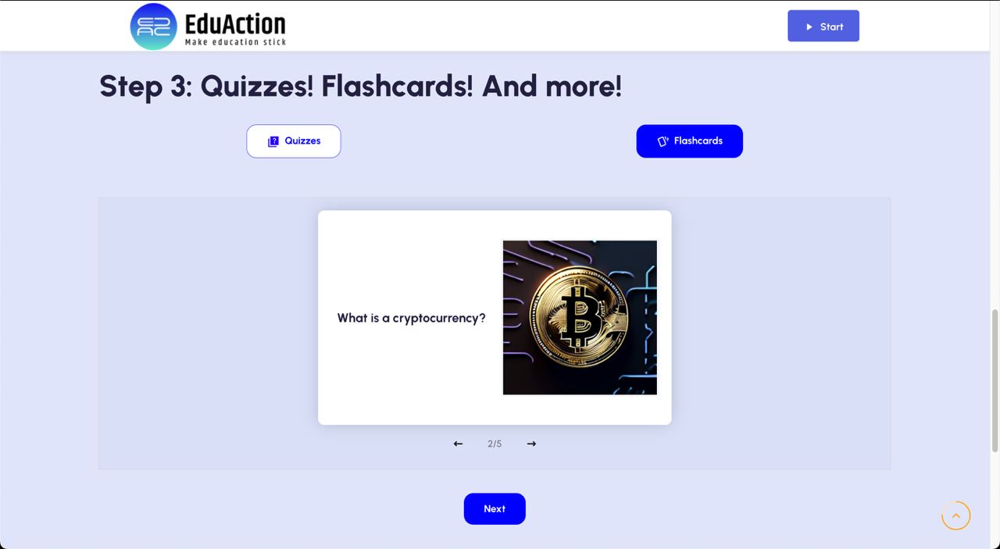
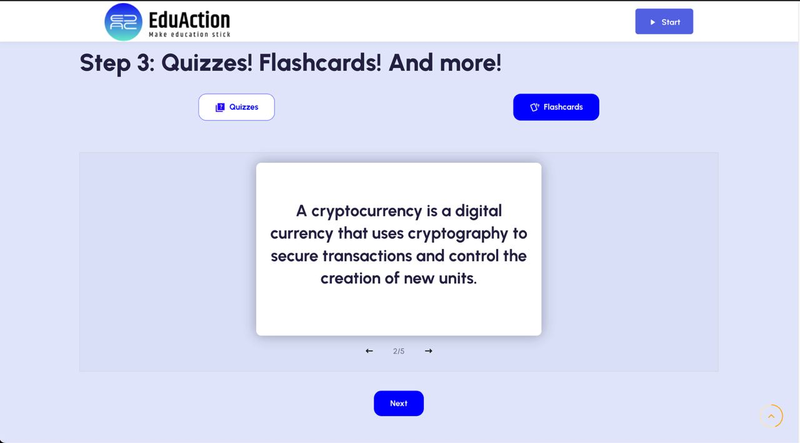

# What is EduAction?

EduAction is an educational content generation application powered by GenAI developed during the Encode Club AI Hackathon London 2024. The user submits a youtube link for a video lecture, tutorial or other instructional video, which is then transcribed and educational content including summaries, quizzes and flash cards are automatically generated. The main objective of the project is to enhance engagement for educators, students, and self-learners. By leveraging the power of artificial intelligence, EduAction aims to add to the way educational content is created and consumed, providing a more interactive and personalized learning experience.


# How it works?
EduAction takes the link to a YouTube video and generates the quizzes, flashcards, summary, and topics.

Here's a high-level description of the generation process:
1) Download YouTube video transcript from the link.
2) Generate the video summary, and list of topics.
3) Generate the flashcards question and the answer with prompts for image generation.
4) Generate flashcards images using Stability.ai.
5) Generate a quiz.
6) Display the learning materials in the web app.






# Tech Stack


## High-level
The architecture is divded into two parts:
- **Backend**, which uses
    - OpenAI API, and Langchain to generate the quizzes, flashcards, summary and topics.
    - Supabase file storage to store the generated materials.
    - Stability.ai API to generate images for the flashcards.
    - FastAPI for the REST API
- **Frontend**, which is written in React and is responsible for the user interface and user experience.

## Low-level
### Backend
The is built upon OpenAI, Stability.ai, FastAPI, Supabase, and Langchain libraries. The backend folder contains the following files:
- `main.py` - contains functions that post the generated materials using FastAPI wrapper and save and upload them using Supabase.
- rag folder
    - `chains.py` - generates Langchain chains to generate summaries, quizzes, and flashcards.
    - `data_models.py` - data validation for the generated prompt.
    - `prompts.py` - store prompts for generating summaries, quizzes, and flashcards.
    - `rag.py` - store functions to generate images for the flashcards, and the text materials. Additionally, if the text is longer than 20,000 characters, we split it using the Langchain chunker so it fits into the context window and the generated materials are more specific.

- `requirements.txt` - a file with all the dependencies to install.
- `setting.py` - pydantic settings, set up environment variable etc.


### Frontend
The website's frontend is built upon React JS, HTML and CSS. The website's pages are based upon a Bootstrap + React JS template. The pages editted in the template are `EventList.js`, and `style.scss`. The integration of the backend to frontend was particularly challenging but was solved by using nested `fetch()` functions (to call Open AI's API). Additionally, the process of implementing colours and styles in buttons and page layouts to fit the Figma design was fun and rewarding. A problem faced in the early mornings before the demo was a race condition error for the quiz, which was solved by redefining and rewriting functions related to quiz generation and answer handling.


# Getting Started

1) Copy the repo
    ```
    git clone https://github.com/codehound42/EduAction.git
    ```
2) Backend:
    - Navigate to the backend folder.
        ```
        cd EduAction/backend
        ```
    - Create and activate the virtual environment in the backend folder.
        ```
        python -m venv venv
        source env/bin/activate
        ```
    - Install requirements.
        ```
        pip install -r requirements.txt
        ```
    - Rename `.env.example` file to `.env` and provide the API keys and URLs.
    - Run the application.
        - For development:
            ```bash
            uvicorn main:app --reload --port 8000 --log-level debug --host 0.0.0.0
            ```
        - For performance:
            ```bash
            gunicorn main:app --workers 4 --worker-class uvicorn.workers.UvicornWorker --bind 0.0.0.0:8000 --timeout 1800
            ```

3) Frontend:
    - Navigate to the frontend folder.
        ```
        cd ../frontend
        ```
    - Install the necessary dependencies.
        ```
        npm install
        ```

    - Run the app.
        ```
        npm start
        ```

# What's next?
- [ ] Add a social aspect of sharing the flashcards and quizzes with others.
- [ ] Add more educational content features assignemtn generation.
    - [ ] "Fill the blanks" exercise
- [ ] Add the recommended learning path.
- [ ] Add option to
    - [ ] Customize the number of flashcards to generate.
    - [ ] Customize the number of quizzes to generate.
    - [ ] Customize the difficulty level.
- [ ] Extra pages (about, contact, etc.).
