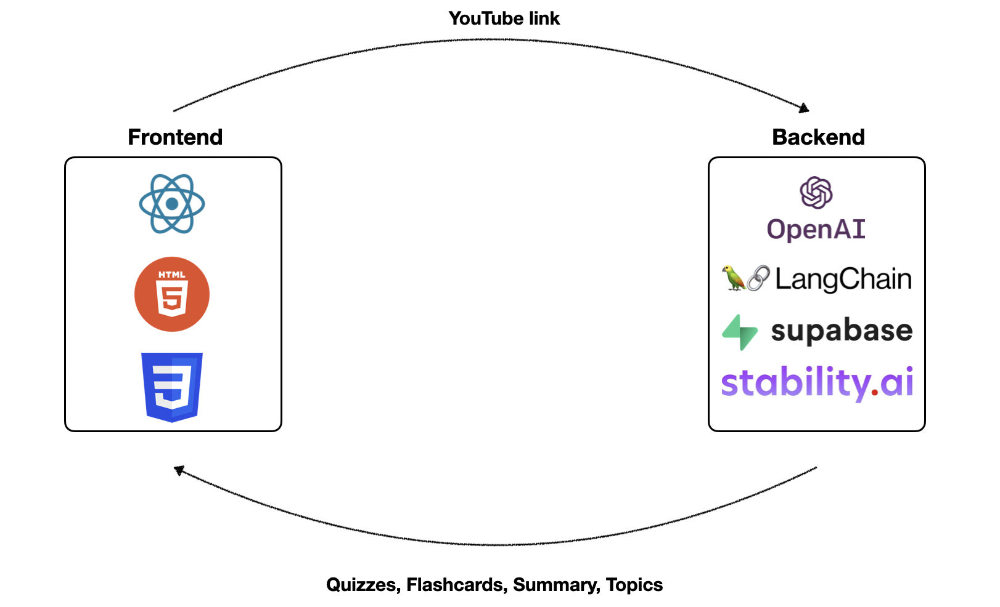

# What is EduAction?

The EduAction project is specifically developed for the Encode Club AI Hackathon London 2024. It is an AI-powered application designed to create customizable educational content, quizzes, and interactive modules. The main objective of this project is to enhance engagement for educators, students, and self-learners. By leveraging the power of artificial intelligence, EduAction aims to add to the way educational content is created and consumed, providing a more interactive and personalized learning experience.

# How it works?


EduAction is taking the link to a YouTube video and generate the quizzes, flashcards, summary, and topics. 
The architecture is divded into two parts:
- **Backend**, which uses
    - OpenAI API, and Langchain to generate the quizzes, flashcards, summary and topics.
    - Supabase to store the generated materials.
    - Stability.ai API to generate images for the flashcards.
- **Frontend**, which is written in React and is responsible for the user interface and user experience.

Here's a high-level description of the generation process:
1) Download YouTube video transcript from the link.
2) Generate the video summary, and list of topics.
3) Generate the flashcards question and the answer with prompts for image generation.
4) Generate flashcards images using Stability.ai.
5) Generate a quiz.
6) Display the learning materials in the web app.

# Getting Started

1) Copy the repo
    ```
    git clone https://github.com/codehound42/EduAction.git
    ```
2) Backend:
    - Navigate to the backend folder.
        ```
        cd EduAction/backend
        ```
    - Create and activate the virtual environment in the backend folder.
        ```
        python -m venv venv
        source env/bin/activate
        ```
    - Install requirements.
        ```
        pip install -r requirements.txt
        ```
    - Rename `.env.example` file to `.env` and provide the API keys and URLs.
    - Run the application.
        ```bash
        uvicorn main:app --reload --port 8000 --log-level debug --host 0.0.0.0
        ```
    
3) Frontend:
    - Navigate to the frontend folder.
        ```
        cd ../frontend
        ```
    - Install the necessary dependencies.
        ```
        npm install
        ```

    - Run the app.
        ```
        npm start
        ``` 


# What's next?
- [ ] Add the assaignment generation.
- [ ] Add the fill the blanks exercises.
- [ ] Add the recommended other materials to learn.
- [ ] Add option to customize number of flashcards to generate.
- [ ] Add option to customize number of quizzes to generate.
- [ ] Add option to customize the difficulty level.